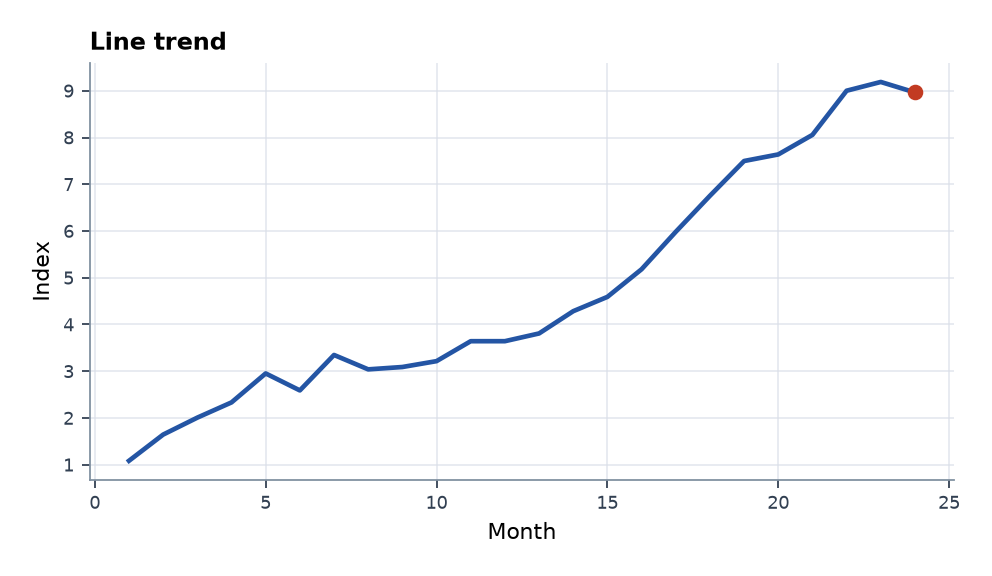
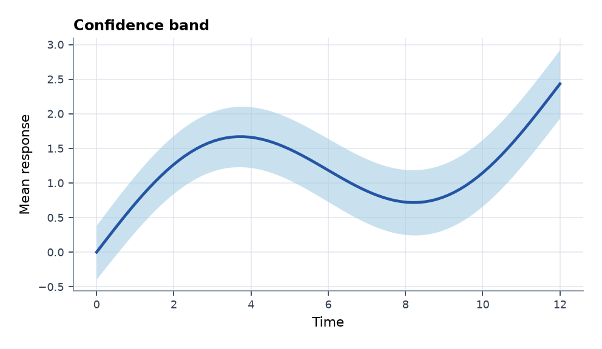
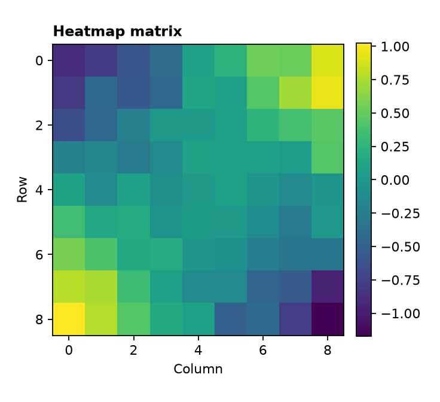
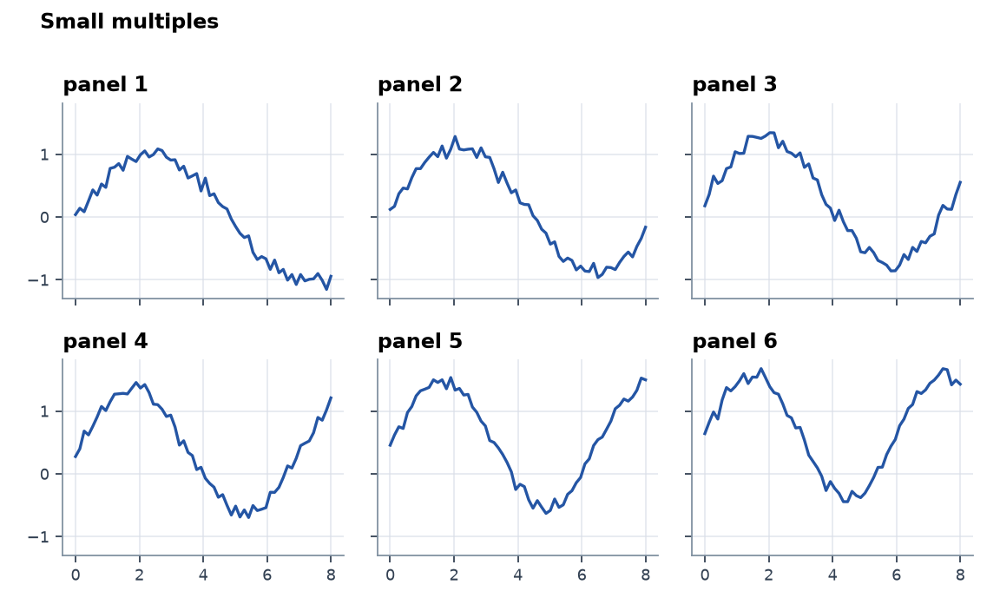

# Python Plotting Skill

[English](README.md) | [简体中文](README.zh-CN.md)

[](https://github.com/Kkkakania/python-plotting-skill/actions/workflows/quality.yml)
[](LICENSE)

`python-plotting-skill` 是一个面向 Codex 的 Python 科研绘图 Skill。它的目标很具体：让 Agent 先判断数据形状和表达目的，再选择合适的 Matplotlib 图形方案，最后生成可运行、可复查的绘图脚本。

它和另外两个仓库配合使用：

- [`matlab-plotting-skill`](https://github.com/Kkkakania/matlab-plotting-skill)：MATLAB 数据到图形流程。
- [`scientific-diagram-skill`](https://github.com/Kkkakania/matlab-plotting-skill/tree/main/skills/scientific-diagram-skill)：Mermaid 和 draw.io 科研图示。
- [`matlab-scientific-figures`](https://github.com/Kkkakania/matlab-scientific-figures)：MATLAB gallery 和 API 证据面。

当前 main 分支保持小而清楚：14 个 Matplotlib 模板、合成数据、gallery 渲染脚本、来源说明和质量检查。不要声称它已经有用户规模、下载量或外部背书。

## 快速开始

```bash
python -m pip install -e ".[test]"
python scripts/render_gallery.py --out docs/gallery --formats png,svg
bash scripts/release_check.sh
```

默认 gallery 使用固定随机种子的合成数据，不读取你的私有数据。

## Gallery 预览

下面几张图都由合成数据生成，只用来展示图形结构和导出效果，不代表真实实验结论。

<table>
  <tr>
    <td><br>Line trend</td>
    <td><br>Confidence band</td>
  </tr>
  <tr>
    <td><br>Heatmap matrix</td>
    <td><br>Small multiples</td>
  </tr>
</table>

## 当前模板

| 模板 | 适合场景 |
|---|---|
| `line_trend` | 单条时间趋势 |
| `multi_line_comparison` | 多条序列对比 |
| `scatter_relationship` | 两个数值变量关系 |
| `regression_scatter` | 散点和简单趋势线 |
| `confidence_band` | 均值和不确定性范围 |
| `grouped_bar` | 分组类别对比 |
| `heatmap_matrix` | 矩阵或网格数值 |
| `density_scatter` | 点很多的 x-y 关系 |
| `box_jitter` | 分布和单个观测值 |
| `violin_plot` | 分组分布形状 |
| `small_multiples` | 同一尺度下的多面板对比 |
| `category_small_multiples` | 多个面板中比较同一组类别 |
| `correlation_matrix` | 相关性概览 |
| `lollipop_ranking` | 更轻量的排序对比 |
| `paired_before_after` | 两个条件下的配对变化 |

## 安装 Skill

把 `skills/python-plotting-skill` 复制或软链接到 Codex 的 skills 目录，然后可以让 Agent 执行类似任务：

```text
用 Python 给这个表选一种合适的科研图。
根据这个数据结构生成 Matplotlib 置信区间图。
做一个 small multiples 图，并说明它可能误导读者的地方。
```

这个 Skill 会要求 Agent 先看数据结构，再选图、写脚本、导出图形，并写清楚图形适合表达什么、不适合证明什么。

## 当前边界

- v0.1 只使用 Matplotlib 和 NumPy。
- Plotly、交互式图和复杂统计模型留到后续版本。
- gallery 只使用合成数据，不放真实学校、实验室、公司或个人数据。
- 质量检查只能发现常见隐私和来源风险，不能替代授权审查。

## 文档

- [图形选择](docs/chart-selection.md)
- [Agent 工作流](docs/agent-workflow.md)
- [来源策略](docs/provenance-policy.md)
- [申请证据摘要](docs/application-evidence.md)

## 反馈入口

- [首次使用反馈](https://github.com/Kkkakania/python-plotting-skill/issues/1)
- [v0.2 模板请求](https://github.com/Kkkakania/python-plotting-skill/issues/2)

## 许可证

MIT。可以自由使用和修改模板，但公开发布时请写清楚来源和改动。
