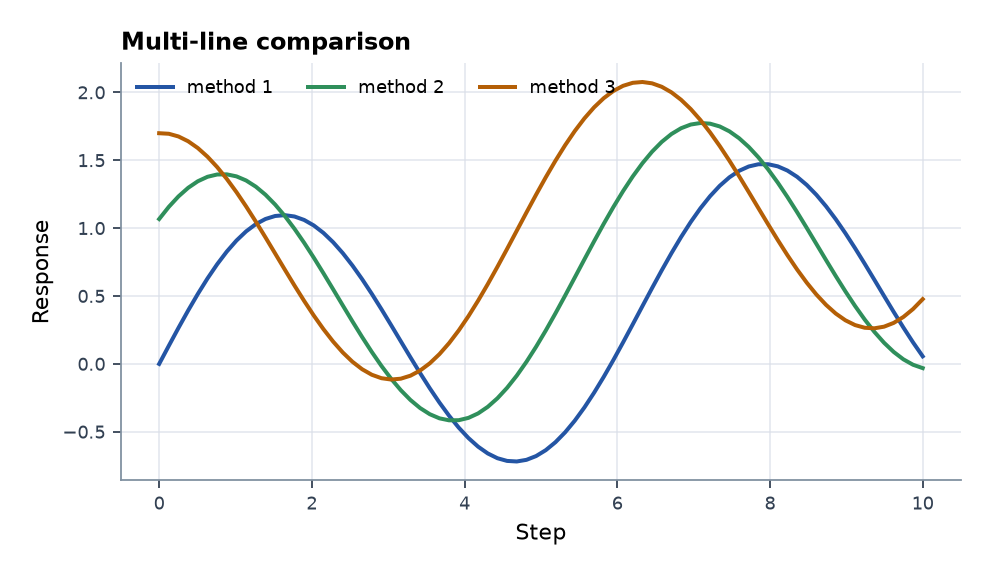
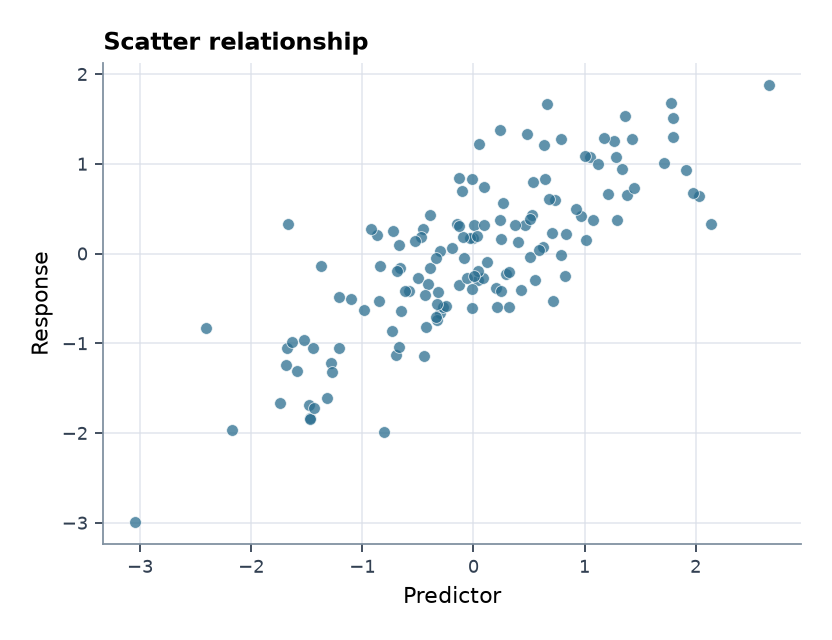
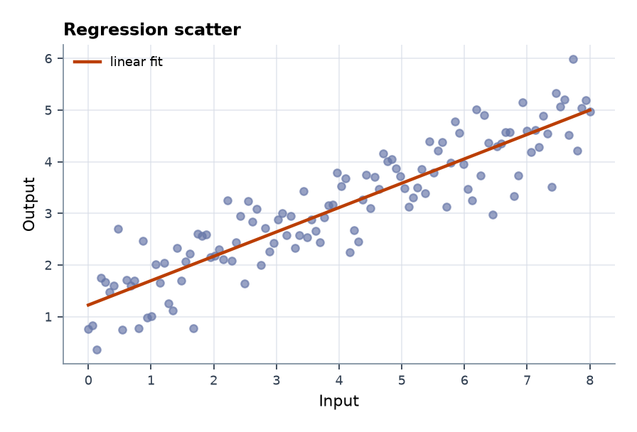
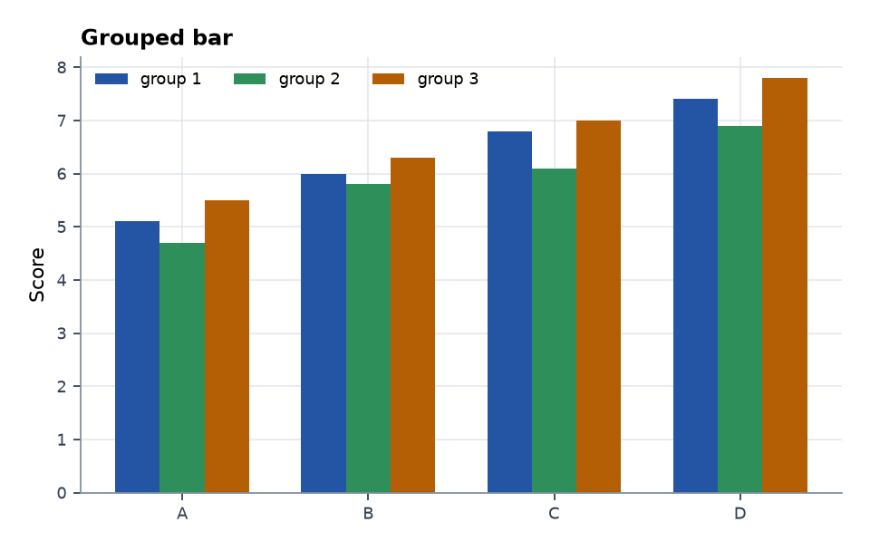
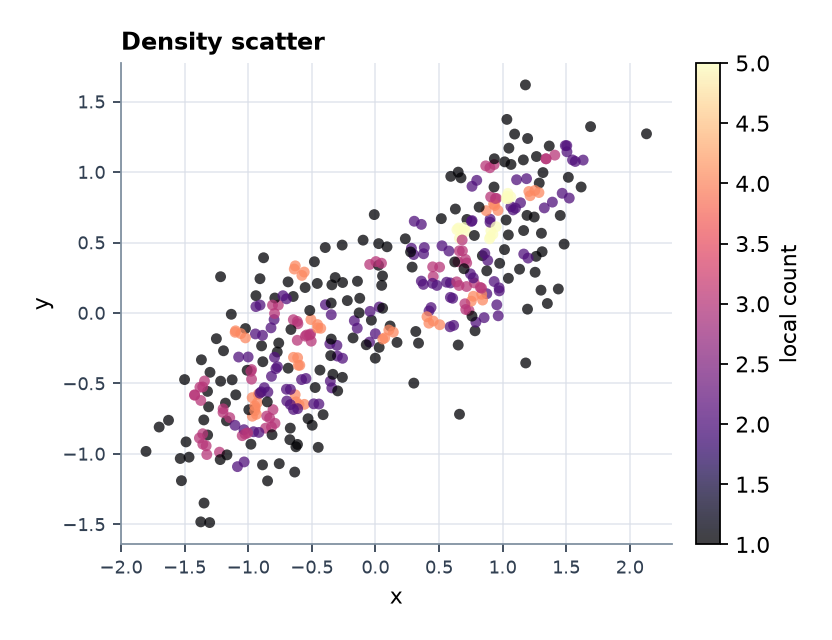
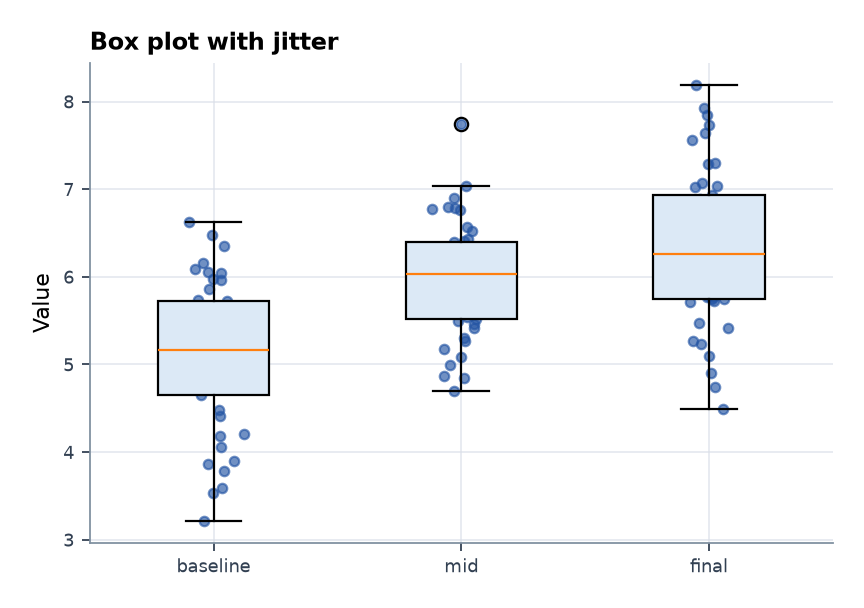
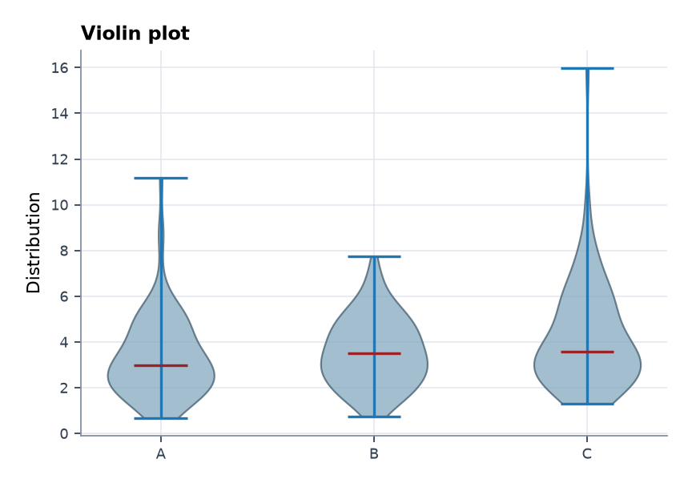
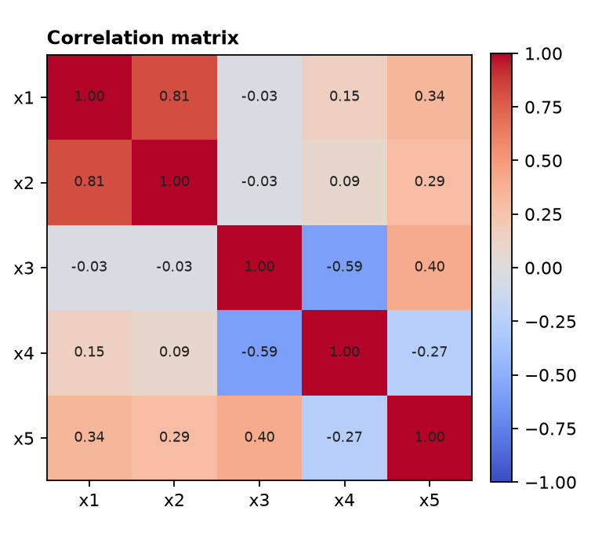
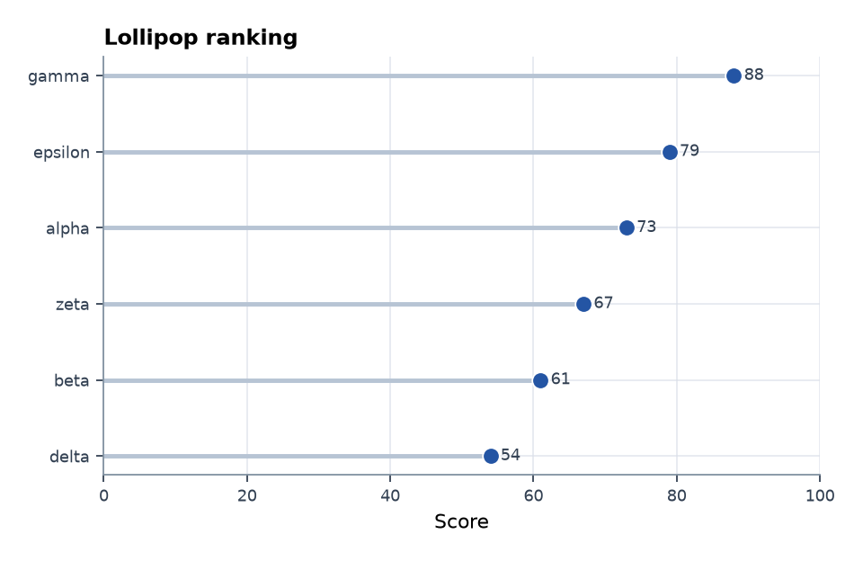
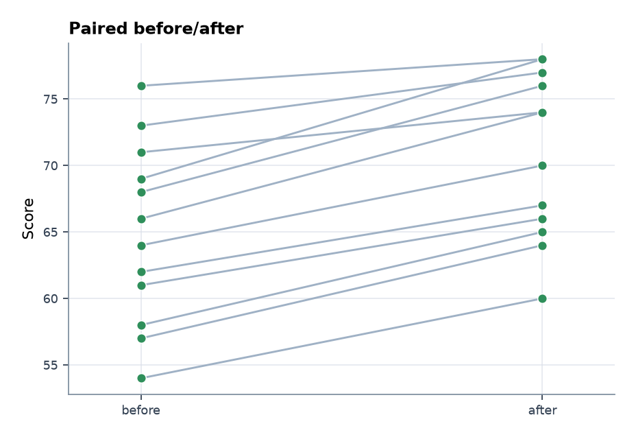

# Gallery

Generated from synthetic data by `scripts/render_gallery.py`.

| Template | Task | Risk | Preview |
|---|---|---|---|
| `line_trend` | Show one trend over time. | Can hide seasonal or subgroup patterns. |  |
| `multi_line_comparison` | Compare several series on one axis. | Too many lines become unreadable. |  |
| `scatter_relationship` | Show relation between two numeric variables. | Correlation does not prove causality. |  |
| `regression_scatter` | Show x-y relation with a fitted trend. | A straight fit can hide nonlinear structure. |  |
| `confidence_band` | Show mean and uncertainty. | Band meaning must be defined. |  |
| `grouped_bar` | Compare categories across groups. | Bars hide within-group variation. |  |
| `heatmap_matrix` | Show matrix or grid values. | Color scale choices can exaggerate small changes. |  |
| `density_scatter` | Show dense x-y points. | Binning can create artificial clusters. |  |
| `box_jitter` | Compare distributions and observations. | Small samples need visible points. |  |
| `violin_plot` | Compare distribution shapes. | Kernel smoothing can imply unsupported detail. |  |
| `small_multiples` | Repeat comparable panels. | Panels need shared scales to compare fairly. |  |
| `correlation_matrix` | Summarize pairwise correlations. | Correlation signs need domain interpretation. |  |
| `lollipop_ranking` | Rank ordered items without heavy bars. | Rankings need uncertainty or sample-size context when values are close. |  |
| `paired_before_after` | Show paired change between two conditions. | The paired design must be real; do not connect unrelated groups. |  |
